# Asthma Risk Factor Analysis — Programming for Data Analytics

<p align="center">
  
  
  
  
</p>

<p align="center">
  <strong>A group data analysis project investigating which patient and environmental factors are most strongly associated with asthma diagnosis — built entirely in R with a hypothesis-driven, iterative EDA workflow.</strong>
</p>

---

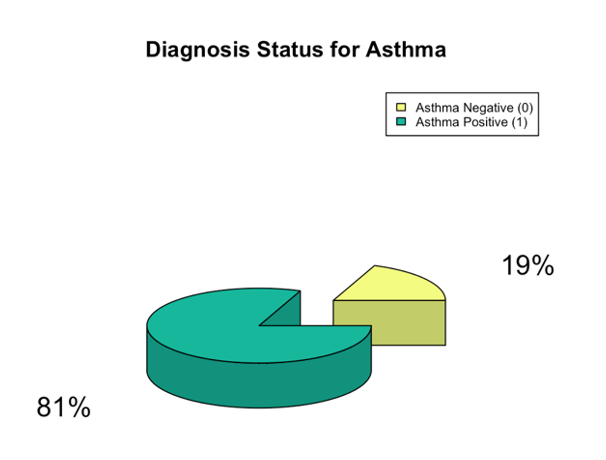

> 81% of the 11,072 patients in this dataset received a positive asthma diagnosis — establishing the foundation for all subsequent risk factor analysis.

---

## Table of Contents

- [Overview](#overview)
- [Hypothesis](#hypothesis)
- [Methodology](#methodology)
- [Dataset Overview](#dataset-overview)
- [Analysis Results](#analysis-results)
  - [Objective 1 — Ethnicity](#objective-1--impact-of-ethnicity)
  - [Objective 2 — Pollen Exposure](#objective-2--impact-of-pollen-exposure)
  - [Objective 3 — Physical Activity](#objective-3--impact-of-physical-activity)
  - [Objective 4 — Family History](#objective-4--impact-of-family-history)
  - [Overall Hypothesis Funnel](#overall-hypothesis-funnel)
  - [Additional Analysis](#additional-analysis)
- [Revised Hypothesis & Final Conclusion](#revised-hypothesis--final-conclusion)
- [Tech Stack & Libraries](#tech-stack--libraries)
- [Project Structure](#project-structure)
- [How to Reproduce](#how-to-reproduce)
- [Limitations](#limitations)
- [References](#references)

---

## Overview

This project analyzes an **11,072-record patient dataset** to identify which demographic, environmental, and lifestyle factors are most strongly associated with an asthma diagnosis. It was built entirely in **R**, combining statistical testing and a wide variety of visualization techniques to explore correlations and iteratively refine a working hypothesis based on what the data actually showed.

The project deliberately follows a transparent, iterative EDA process — an initial hypothesis was formed, tested rigorously, found to be statistically weak, and then **revised based on evidence** — arriving at a stronger, data-backed final conclusion. This mirrors a real-world analytical workflow rather than cherry-picking results to fit an assumption.

> This was a group assignment for the *Programming for Data Analytics* module (072024-MHJ) at Asia Pacific University of Technology & Innovation (APU), 2024.

---

## Hypothesis

**Initial hypothesis:**

> *"Patients of Caucasian ethnicity who have a pollen exposure greater than 4, engage in over six hours of physical activity per week, and do not have a family history of asthma are at a heightened risk of experiencing asthma attacks."*

Four variables were selected — **Ethnicity**, **Pollen Exposure**, **Physical Activity**, and **Family History of Asthma** — based on commonly cited asthma risk factors in literature.

---

## Methodology

### 1. Data Import, Cleaning & Exploration
- Loaded the raw dataset (11,072 records, 29 columns) via `read.csv()`
- Handled missing values using **mode imputation** for categorical fields and **mean imputation** for continuous fields
- Verified data integrity with `summary()`, `str()`, and `View()` after each cleaning step

### 2. Hypothesis-Driven Sequential Filtering
- Isolated the diagnosed subset (8,968 patients where `Diagnosis = 1`)
- Applied each hypothesis variable as a sequential filter and tracked how many patients survived each stage
- Used retention percentage as a proxy for each variable's predictive strength

### 3. Statistical Testing
- **Chi-Square tests of independence** for categorical relationships (Ethnicity × Diagnosis, Family History × Diagnosis)
- **ANOVA + Tukey HSD post-hoc tests** to assess whether physical activity significantly differed across groups
- **Pearson correlation matrices** across all numeric variables to surface hidden relationships

### 4. Multi-Perspective Visualization
Each variable was explored using multiple chart types — violin plots, mosaic plots, heatmaps, dumbbell plots, waffle charts, lollipop charts, 3D scatter plots (plotly), and radar charts — to triangulate findings from different visual angles before drawing conclusions.

### 5. Full Dataset Re-Analysis & Hypothesis Revision
When the initial hypothesis proved too weak, the team performed a second full pass across all 29 columns to identify stronger predictor variables, ultimately revising the hypothesis around the new evidence.

---

## Dataset Overview

| Property | Value |
|---|---|
| Total records | 11,072 |
| Diagnosed (Asthma = 1) | 8,968 (81%) |
| Non-diagnosed (Asthma = 0) | 2,104 (19%) |
| Features | 29 columns |
| Key variables | Ethnicity, BMI, Pollen/Pollution/Dust Exposure, Physical Activity, Family History, Lung Function (FEV1/FVC), Pet Allergy, Eczema, Hay Fever, and more |

**Gender distribution across the full dataset:**

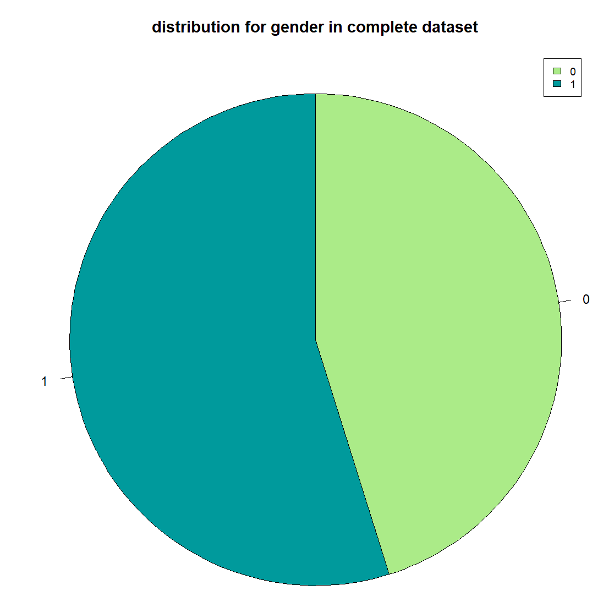

---

## Analysis Results

### Objective 1 — Impact of Ethnicity

The analysis examined whether Caucasian ethnicity (coded as 0) was associated with higher asthma rates. A Chi-Square test confirmed a statistically significant relationship between ethnicity and diagnosis (p < 2.2e-16). However, the Caucasian filter only retained ~56% of diagnosed patients — below the 70% threshold used to define a "strong" variable.

A lollipop chart comparing physical activity levels across ethnicities and family history groups further showed that Caucasians and African Americans tended to have higher average physical activity, but no single ethnicity stood out as a dominant asthma predictor:

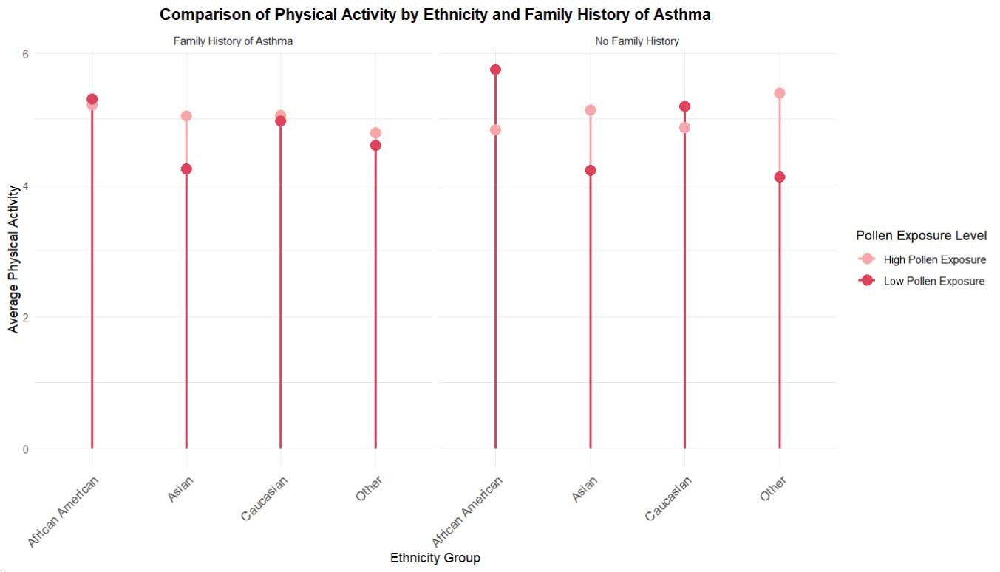

**Funnel after Ethnicity filter:**

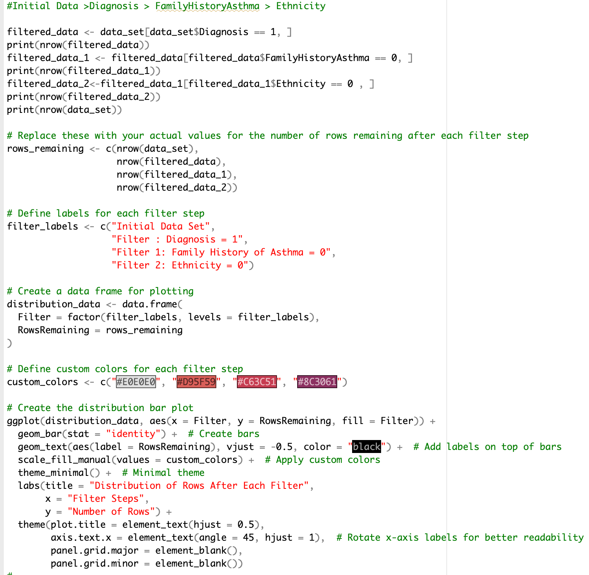

---

### Objective 2 — Impact of Pollen Exposure

Pollen exposure (≥ 4 on a 0–10 scale) was tested as the second hypothesis filter. Around 87% of diagnosed patients had high pollen exposure, making it the single strongest variable in the initial hypothesis. However, its correlation with physical activity was near zero (r = -0.01), suggesting it operates independently of other factors.

A waffle chart illustrates how pollen exposure dominates the diagnosed patient pool compared to other filters:

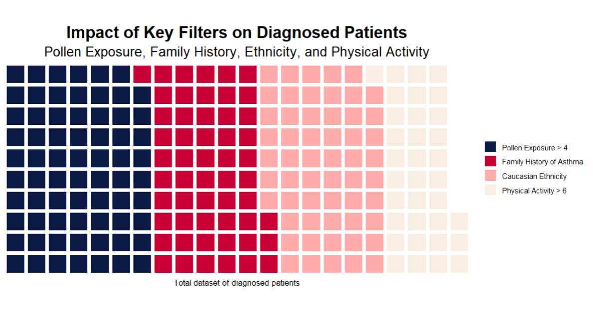

A faceted bar chart comparing pollen exposure across ethnicity, physical activity level, and family history shows Caucasians with low physical activity had the highest number of high pollen exposure cases:

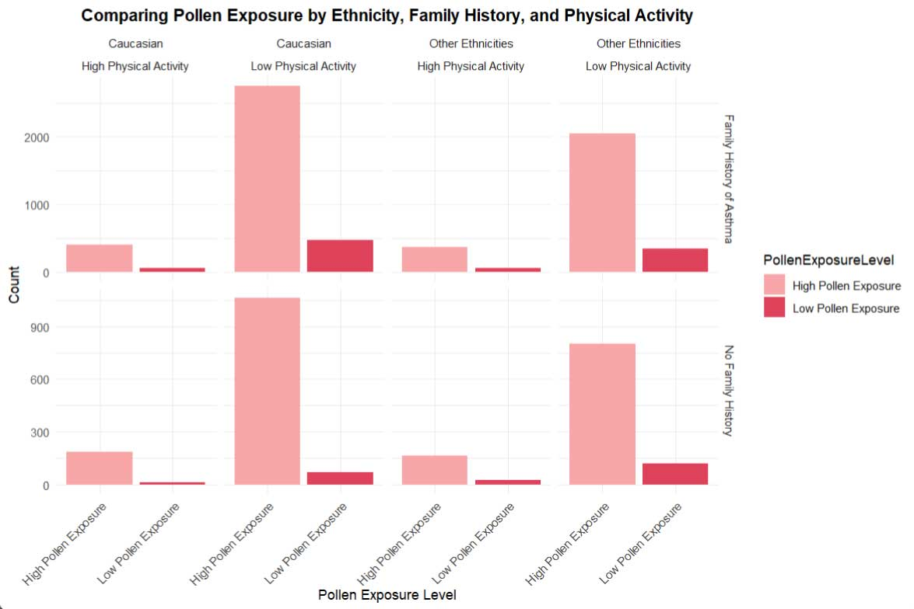

**Funnel after Pollen Exposure filter:**

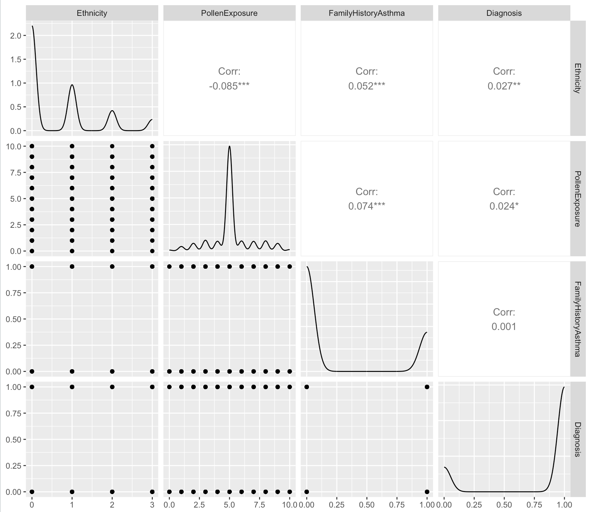

---

### Objective 3 — Impact of Physical Activity

Physical activity levels exceeding 6 hours per week formed the third filter. ANOVA results confirmed statistical significance (F = 10.97, p < 2e-16), but only ~7% of the diagnosed population exercised more than 6 hours weekly — making it the weakest filter in practical terms.

A multi-factor heatmap reveals that patients with **low physical activity and high pollen exposure** had the largest number of asthma cases, regardless of family history:

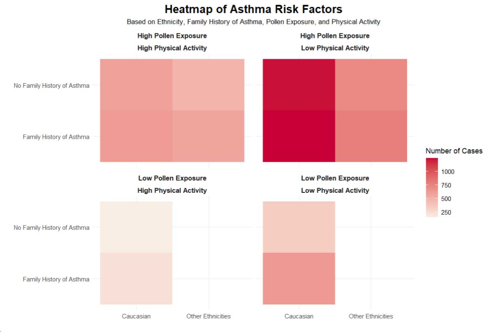

---

### Objective 4 — Impact of Family History

Family history of asthma was the fourth filter. A Chi-Square test confirmed significance (X² = 1865.3, p < 2.2e-16), and ~73% of diagnosed patients had no family history of asthma. However, the combination with other filters quickly narrowed the pool.

A dumbbell plot comparing pollen exposure cases across ethnicity, family history, and physical activity groups shows that Caucasians with a family history consistently had higher pollen exposure counts:

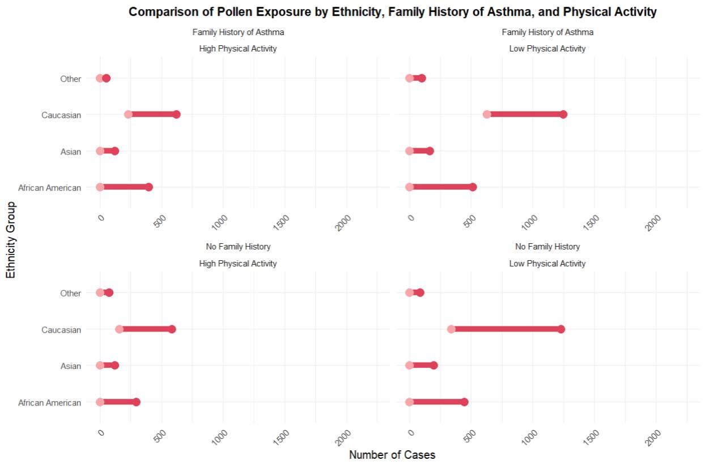

**Funnel after Family History filter:**

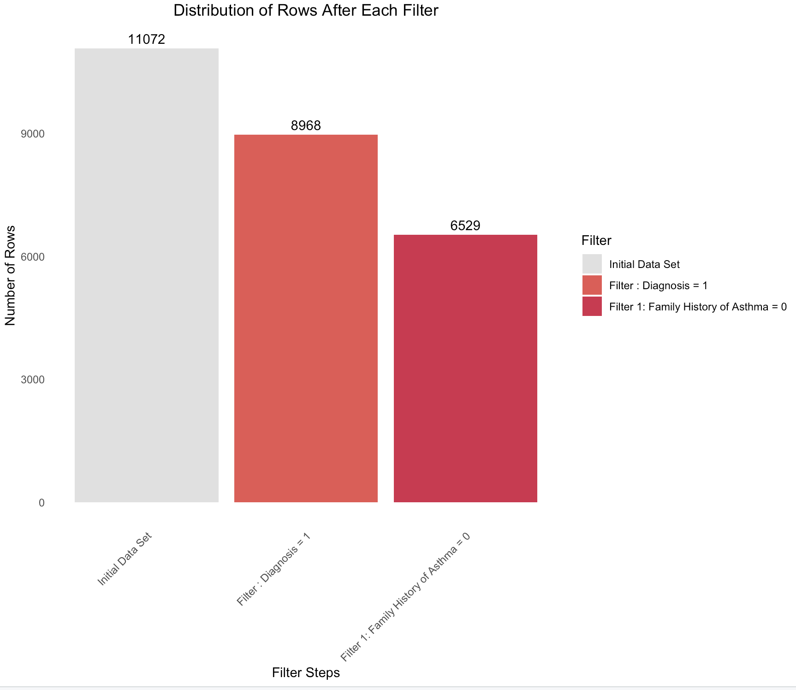

---

### Overall Hypothesis Funnel

Applying all four filters sequentially to the diagnosed population (8,968 patients) produced this result:

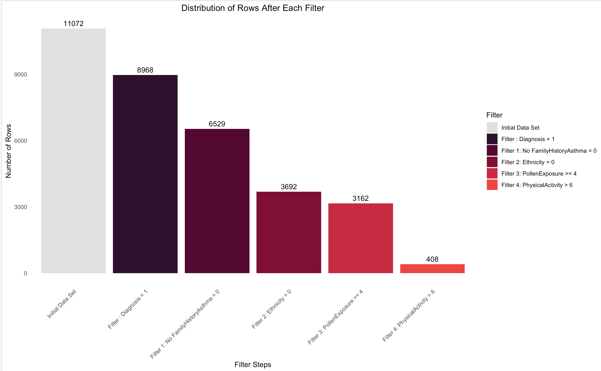

| Filter Step | Patients Remaining | % of Diagnosed |
|---|---|---|
| Diagnosed (Diagnosis = 1) | 8,968 | 100% |
| No Family History of Asthma | 6,529 | ~73% |
| Caucasian Ethnicity | 3,692 | ~41% |
| Pollen Exposure ≥ 4 | 3,162 | ~35% |
| Physical Activity > 6 hrs/week | **408** | **~5%** |

Only **~5% of diagnosed patients** satisfied all four conditions — making the initial hypothesis statistically too weak to be useful.

A radar chart visualizing each team member's independent filtering results confirms this consistently weak signal across all four variables:

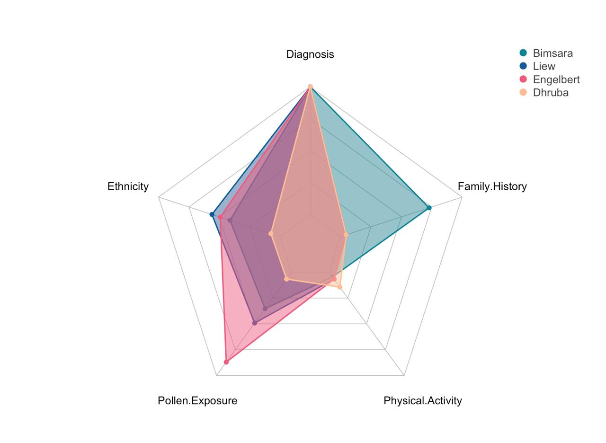

---

### Additional Analysis

To better understand interactions between variables, additional multi-variable analyses were conducted across the full dataset.

**Diet Quality vs BMI by Diagnosis** — a scatter plot exploring whether lifestyle factors like diet and BMI differed between diagnosed and non-diagnosed patients:

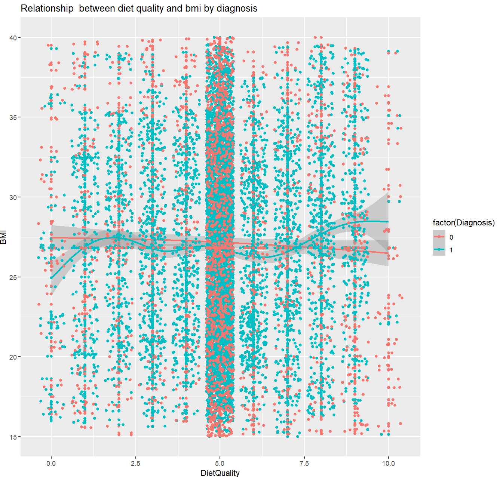

**Lung Function (FVC) vs Ethnicity** — comparing how many diagnosed patients had high lung function FVC versus Caucasian ethnicity, revealing lung function as a far stronger predictor:

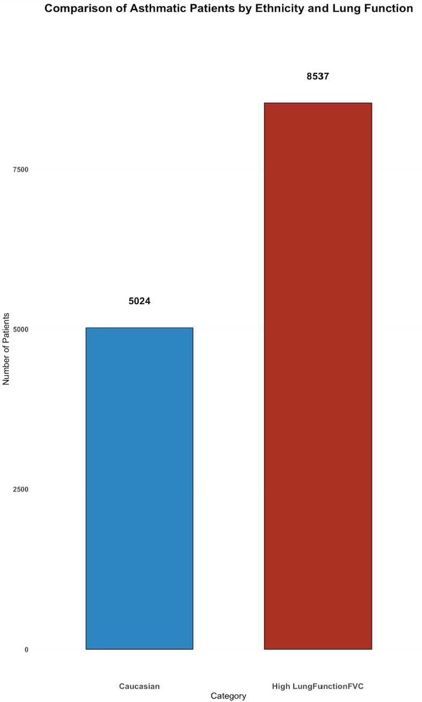

---

## Revised Hypothesis & Final Conclusion

After discovering that `LungFunctionFVC` and `PetAllergy` showed much stronger associations with diagnosis than the original four variables, the hypothesis was rebuilt with evidence-based thresholds:

**Pet Allergy vs Family History of Asthma — comparing prevalence among diagnosed patients:**

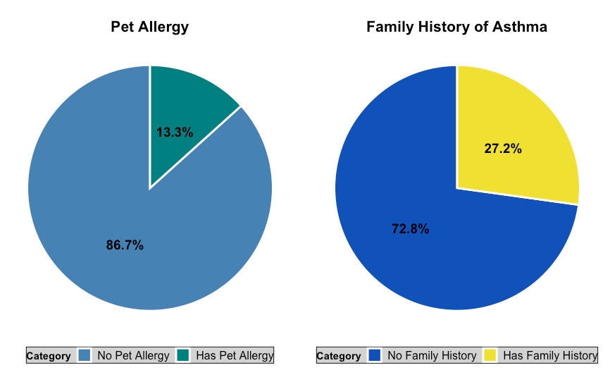

- **86.7%** of diagnosed patients had no pet allergy
- **72.8%** had no family history of asthma

This made *absence of pet allergy* a more consistent signal than family history.

**Revised final hypothesis:**

> *"Patients without pet allergies, with lung function (FVC) greater than three, engaging in more than three hours of physical activity, and exposed to pollen levels exceeding two, are at a heightened risk of asthma."*

This revised hypothesis was satisfied by **6,679 of 8,968 diagnosed patients (~74.5%)** — a dramatically stronger result than the original ~5%.

---

## Tech Stack & Libraries

| Category | Tools |
|---|---|
| **Language** | R |
| **Data Wrangling** | `dplyr`, `tidyr`, `janitor`, `Tmisc`, `readr` |
| **Core Visualization** | `ggplot2`, `GGally` (`ggpairs`), `ggpubr`, `gridExtra`, `patchwork` |
| **Specialized Charts** | `waffle`, `ggmosaic`, `fmsb` (radar), `ggstream`, `viridis`, `hrbrthemes` |
| **3D / Interactive** | `plotly` |
| **Statistics** | Chi-Square tests, ANOVA + Tukey HSD, Pearson correlation (`corrplot`, `PerformanceAnalytics`) |
| **Utilities** | `broom`, `AICcmodavg`, `plotrix`, `psych`, `reshape2` |

---

## Project Structure

```
asthma-risk-factor-analysis/
│
├── docs/
│   └── images/                                    # All chart images used in this README
│       ├── diagnosis_distribution.png
│       ├── gender_distribution.png
│       ├── ethnicity_filter_funnel.png
│       ├── ethnicity_physical_activity_lollipop.jpeg
│       ├── pollen_filter_funnel.png
│       ├── pollen_waffle_impact.jpeg
│       ├── pollen_ethnicity_bar_faceted.jpeg
│       ├── physical_activity_risk_heatmap.jpeg
│       ├── family_history_funnel.png
│       ├── family_history_pollen_dumbbell.jpeg
│       ├── full_hypothesis_funnel.png
│       ├── radar_chart_team_summary.png
│       ├── diet_quality_bmi_scatter.png
│       ├── lung_function_vs_ethnicity.png
│       └── pet_allergy_vs_family_history.png
│
├── Asthma_Analysis_R_File.R                       # Full R analysis script
├── Asthma_dataset.csv                             # Raw dataset (11,072 records)
├── Dataset Description.txt                        # Column definitions and data dictionary
└── README.md
```

---

## How to Reproduce

1. Clone this repository
2. Open `Asthma_Analysis_R_File.R` in RStudio
3. Install required packages if not already installed:

```r
install.packages(c(
  "dplyr", "tidyr", "ggplot2", "GGally", "ggpubr", "gridExtra",
  "waffle", "ggmosaic", "fmsb", "viridis", "hrbrthemes",
  "plotly", "corrplot", "PerformanceAnalytics", "broom", "AICcmodavg",
  "janitor", "plotrix", "psych", "reshape2", "patchwork"
))
```

4. Run the script from top to bottom — all charts and statistical outputs will be generated in sequence

---

## Limitations

| Limitation | Detail |
|---|---|
| Correlational, not causal | All findings describe statistical association, not proven causation |
| Single dataset | Results are specific to this dataset's population and may not generalize |
| Threshold sensitivity | Revised hypothesis thresholds were chosen based on this dataset's distribution and need external validation |
| No predictive model | This is a descriptive/exploratory project — no classification model was built or evaluated |

---

## References

- Bevans, R. (2020). *ANOVA in R: A Complete Step-by-Step Guide with Examples.* Scribbr.
- DataFlair Team. (2018). *Chi-Square Test in R.* DataFlair.
- Holtz, Y. *3D — The R Graph Gallery.* r-graph-gallery.com
- LiquidBrain Bioinformatics. (2021). *How to Plot a 3D Graph — Plotly Tutorial in RStudio.* YouTube.
- DataCamp. *Learn R, Python & Data Science Online.* datacamp.com

---

<p align="center">
  <em>Programming for Data Analytics (072024-MHJ) — Asia Pacific University of Technology & Innovation, 2024</em>
</p>
